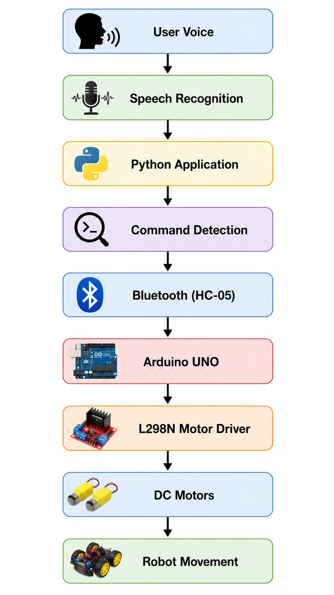

# 🚗 Voice Controlled Robot Car with Rule-Based Chatbot

A Bluetooth-based **Voice Controlled Robot Car** developed using **Arduino UNO** and **Python**. The robot responds to real-time voice commands for movement while also providing predefined conversational responses through a **Rule-Based Chatbot**.

The project demonstrates the integration of **Speech Recognition**, **Bluetooth Communication**, **Arduino Motor Control**, and **Text-to-Speech (TTS)** to create an interactive robotic system capable of wireless robot navigation and human-robot interaction.

---

## 📖 Overview

The **Voice Controlled Robot Car with Rule-Based Chatbot** is an intelligent robotics project that enables users to control a robot wirelessly using voice commands. The system captures voice input through a microphone, converts speech into text using Python's Speech Recognition library, identifies movement or chatbot commands, and sends corresponding instructions to an Arduino UNO through an HC-05 Bluetooth module.

The Arduino processes these commands and controls the L298N Motor Driver, which drives the DC motors for robot movement. Alongside robot navigation, the project includes a **Rule-Based Chatbot** capable of answering predefined conversational questions using Text-to-Speech (TTS), providing an interactive user experience.

---

## ✨ Features

- 🎙️ Real-Time Voice Recognition
- 🤖 Rule-Based Chatbot
- 📡 Bluetooth Communication (HC-05)
- 🚗 Wireless Robot Navigation
- 🔊 Text-to-Speech Responses
- ⚡ Real-Time Command Processing
- 🛑 Safe Stop Function
- 💻 Easy-to-Use Python Interface
- 🔄 Bidirectional Robot Control
- 📢 Natural Voice Interaction

---

## 🎯 Supported Voice Commands

### 🚗 Robot Movement

| Voice Command | Arduino Command | Robot Action |
|--------------|-----------------|--------------|
| Forward | `F` | Move Forward |
| Backward | `B` | Move Backward |
| Left | `L` | Turn Left |
| Right | `R` | Turn Right |
| Stop | `S` | Stop Robot |

---

### 🤖 Chatbot Commands

The Rule-Based Chatbot supports predefined conversational responses.

Examples include:

- Hello
- Hi
- How are you?
- What is your name?
- Who made you?
- What can you do?
- Thank you
- Goodbye
- Bye
- Exit

---

## 🛠 Technologies Used

### Programming Languages

- Python
- Arduino C++

### Hardware Components

- Arduino UNO
- HC-05 Bluetooth Module
- L298N Motor Driver
- Robot Chassis
- DC Gear Motors
- Wheels
- Jumper Wires
- Battery Pack

### Python Libraries

- SpeechRecognition
- PySerial
- gTTS
- playsound
- os
- time

---

## ⚙ Hardware Connections

### HC-05 Bluetooth Module

| HC-05 | Arduino UNO |
|--------|-------------|
| VCC | 5V |
| GND | GND |
| TXD | Pin 10 |
| RXD | Pin 11 |

---

### L298N Motor Driver

| L298N | Arduino UNO |
|--------|-------------|
| IN1 | Pin 2 |
| IN2 | Pin 3 |
| IN3 | Pin 4 |
| IN4 | Pin 5 |
| GND | GND |

---

## 🔄 System Workflow

<p align="center">
  
</p>

The workflow begins when the user speaks a voice command through the microphone. The Python application converts the speech into text using Speech Recognition, identifies whether the input is a movement or chatbot command, and transmits the corresponding instruction to the Arduino UNO through the HC-05 Bluetooth module. The Arduino controls the L298N Motor Driver, which powers the DC motors to perform the requested movement. For conversational queries, the Rule-Based Chatbot generates predefined responses using Google Text-to-Speech (gTTS).

---

## 🚀 Installation

### 1️⃣ Clone the Repository

```bash
git clone https://github.com/your-username/Voice-Controlled-Robot-Car.git
```

### 2️⃣ Navigate to the Project Folder

```bash
cd Voice-Controlled-Robot-Car
```

### 3️⃣ Install Python Dependencies

```bash
pip install -r requirements.txt
```

Or install them manually:

```bash
pip install pyserial
pip install SpeechRecognition
pip install gTTS
pip install playsound
pip install pyaudio
```

---

## ▶️ Usage

### Upload Arduino Code

1. Open the Arduino IDE.
2. Open the Arduino sketch.
3. Select **Arduino UNO**.
4. Select the correct COM Port.
5. Upload the code.

---

### Pair the Bluetooth Module

- Pair HC-05 with your computer.
- Default PIN:

```
1234
```

or

```
0000
```

---

### Configure the COM Port

Inside `main.py`, update:

```python
COM_PORT = "COM3"
```

Replace `COM3` with your Bluetooth COM port if necessary.

---

### Run the Python Program

```bash
python main.py
```

Example Commands

```
Forward
Backward
Left
Right
Stop
Hello
How are you
Who made you
What can you do
Bye
```

---

## 🧠 Rule-Based Chatbot

The chatbot implemented in this project is a **Rule-Based Conversational Assistant**. It recognizes predefined voice commands and questions using conditional statements and responds through Google Text-to-Speech.

Unlike AI-powered conversational models, this chatbot follows predefined logic, making it lightweight, fast, and ideal for embedded robotics projects.

---

## 📊 Testing Results

| Test | Status |
|------|--------|
| Voice Recognition | ✅ Passed |
| Bluetooth Communication | ✅ Passed |
| Arduino Communication | ✅ Passed |
| Forward Movement | ✅ Passed |
| Backward Movement | ✅ Passed |
| Left Turn | ✅ Passed |
| Right Turn | ✅ Passed |
| Stop Function | ✅ Passed |
| Chatbot Responses | ✅ Passed |
| Text-to-Speech | ✅ Passed |

---

## 📈 Future Enhancements

- AI-Powered Chatbot Integration
- OpenAI API Integration
- Mobile Application Control
- Computer Vision Integration
- Face Recognition
- Object Detection
- Obstacle Avoidance
- Autonomous Navigation
- IoT-Based Monitoring
- PWM Speed Control
- Battery Monitoring System

---

## 🎓 Learning Outcomes

This project demonstrates practical implementation of:

- Arduino Programming
- Embedded Systems
- Robotics
- Bluetooth Communication
- Voice Recognition
- Human-Robot Interaction
- Python Programming
- Motor Control
- Rule-Based Artificial Intelligence

---

## 🤝 Contributing

Contributions are welcome!

If you would like to improve this project, feel free to fork the repository, create a new branch, and submit a pull request.

---

## 📄 License

This project is licensed under the **MIT License**.

---

## 👨‍💻 Developer

**Muhammad Daniyal**

Artificial Intelligence Student

Institute of Computational Intelligence

Gomal University, Dera Ismail Khan, Pakistan

---

## ⭐ Support

If you found this project helpful, please consider giving it a **⭐ Star** on GitHub.

Your support motivates future improvements and helps others discover this project.
